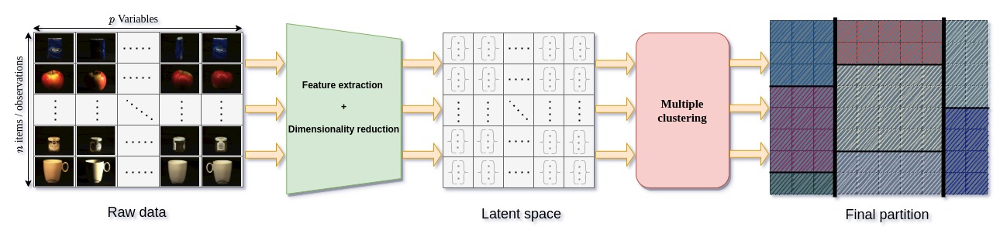

# Emerging properties from Bayesian Non-Parametric for multiple clustering: Application for multi-view image dataset

#### Clustering metrics results on Aloi dataset
RI, Purity and NMI for multiple clustering methods considering the Material variable from annotation as ground truth:
 
 | views   | RI    |Purity | NMI   |
 |---------|-------|-------|-------|
 | view 1  | 0.899 | 0.682 | 0.596 |
 | view 2  | 0.899 | 0.669 | 0.592 |
 | view 3  | 0.899 | 0.685 | 0.599 |
 | view 4  | 0.898 | 0.576 | 0.562 |
 | view 5  | 0.898 | 0.586 | 0.563 |
 | view 6  | 0.898 | 0.572 | 0.559 |
 | view 7  | 0.898 | 0.572 | 0.557 |
 | view 8  | 0.899 | 0.587 | 0.565 |
 | view 9  | 0.898 | 0.591 | 0.564 |
 | view 10 | 0.898 | 0.579 | 0.560 |
 | view 11 | 0.898 | 0.574 | 0.558 |
 | view 12 | 0.898 | 0.566 | 0.557 |
 | view 13 | 0.898 | 0.572 | 0.559 |
 | view 14 | 0.898 | 0.579 | 0.561 |
 | view 15 | 0.899 | 0.589 | 0.565 |
 | view 16 | 0.898 | 0.582 | 0.561 |
 | view 17 | 0.898 | 0.559 | 0.549 |
 | view 18 | 0.898 | 0.584 | 0.559 |
 | view 19 | 0.898 | 0.567 | 0.557 |
